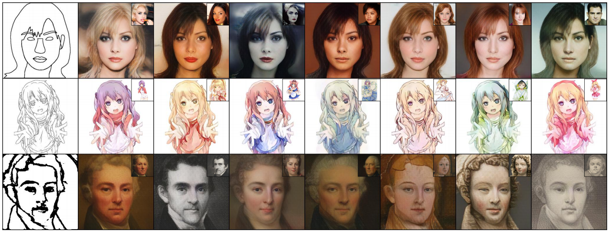

# SDL

PyTorch Implementation of Our Paper "Self-driven Dual-path Learning for Reference-based Line Art Colorization under Limited Data".

<p align='center'>  
  
</p>

## Environment
```
python==3.8.12
numpy==1.21.3
torch==1.7.0
torchvision==0.8.0
tensorboard==2.12.0
scikit-image==0.18.3
opencv-python==4.5.4.58
```

## Datasets

CelebA-HQ: Combine the edges of segmentation masks from [CelebAMask-HQ](https://github.com/switchablenorms/CelebAMask-HQ) to form line arts.

ASCP: [Downloading Link](https://www.kaggle.com/ktaebum/anime-sketch-colorization-pair).

MetFaces: [Downloading Link](https://github.com/NVlabs/metfaces-dataset). Use HED algorithm to detect edges.

All images should be resized to 256×256. Please refer to folder "datasets" for the layout.


## Training
```
python train.py --dataroot ./datasets/CelebA-HQ --tps_aug 1 --batchSize 10 --name CelebA-HQ-256
```
Note: 

1 You need to put a [Pretrained Vgg Model](https://pan.baidu.com/s/1z0KmArXn0AQMlEOlMtyjrQ) (Extraction Code: w794) in folder "models" before training.

2 You can try different values for weight_ct_path (from 0 to 1) to check the visual effects. 

3 You can decide whether to use positional encoding (Line 102 and 122 in file "models/cross_attention.py").

## Inference
```
python test.py --dataroot ./datasets/CelebA-HQ --which_epoch latest --name CelebA-HQ-256
```

## Citation

If you find this useful for your research, please cite our paper.


    @article{wu2023self,
         title={Self-driven Dual-path Learning for Reference-based Line Art Colorization under Limited Data},
         author={Wu, Shukai and Yan, Xiao and Liu, Weiming and Xu, Shuchang and Zhang, Sanyuan},
         journal={IEEE Transactions on Circuits and Systems for Video Technology},
         year={2023},
         publisher={IEEE}
    }


## Acknowledgments

This repository borrows some code from [DeepSIM](https://github.com/eliahuhorwitz/DeepSIM), [QS-Attn](https://github.com/sapphire497/query-selected-attention) and [CUT](https://github.com/taesungp/contrastive-unpaired-translation).

